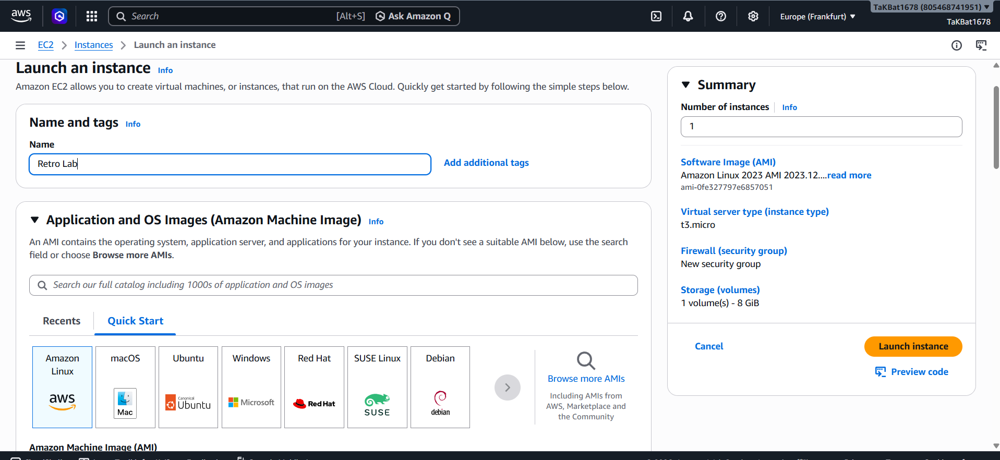

ICT171

Introduction to Server Environments and Architectures

Assignment 3

Cloud Server Project & Video Explainer

Retro Lab

A Cloud-Hosted Retro Gaming Hardware Marketplace

IP Address (Elastic IP): 3.78.92.231

Website Link (Domain):  https://retrolabs.online/

GitHub Repository:  https://github.com/Tmdoshi/RetroLab

Video Walkthrough: https://drive.google.com/drive/u/0/folders/1frDC-erXTJ8oK5j9isX08J1tBlVglpff

Submitted by: Tanishk Doshi | Student Number: 36185495


## Project Overview

Retro Lab is a marketplace web application for buying and selling retro gaming hardware consoles, handhelds, computers, and accessories. It is built with Flask (Python) on the backend, SQLite for data storage, and is served in production through Apache using mod_wsgi, secured with a manually configured SSL/TLS certificate from Let's Encrypt.

This document walks through the entire build process, from a bare EC2 instance through to a fully secured, publicly accessible site, explaining the reasoning behind each configuration choice rather than just listing commands.


## Before Setting Up

Before beginning, the following were required:

- An AWS account with access to the EC2 console
- A registered domain name (retrolabs.online, purchased through GoDaddy)
- A GitHub account and repository to host the application code and documentation
- A local machine with SSH access (Windows PowerShell was used throughout this project)
Once these were ready, the EC2 instance could be set up.


## Setting Up the EC2 Instance

The application is hosted on an AWS EC2 instance, configured manually via SSH no prebuilt AMIs or bundled server images were used, in line with the assignment's Infrastructure as a Service requirement.

1. In the EC2 console, Launch Instance was selected from the dashboard.

2. A name was entered for the instance ("Retro Lab").

3. Under Application and OS Images, Ubuntu was selected as the operating system via the Quick Start tab.



*Figure 1 — Launching a new EC2 instance and naming it "Retro Lab"*

4. The specific AMI details were reviewed before confirming architecture, boot mode, and publish date.

5. Under Key pair (login), a new key pair named "retrolab-sg" was created, using RSA encryption and the.pem private key format (for use with OpenSSH on Windows). The key pair was downloaded and stored securely, as it would be needed for every future SSH connection.


*Figure 3 — Creating the key pair for SSH access*

6. Under Network settings, a new security group was created, with inbound rules allowing SSH (port 22), HTTP (port 80), and HTTPS (port 443) traffic.


*Figure 4 — Configuring network settings and security group inbound rules*

Instance type t3.micro was used with default storage (8 GiB gp3 volume), which is sufficient for a lightweight Flask application and SQLite database.

Once the instance was running and status checks passed, the next step was associating an Elastic IP address.


## Associating an Elastic IP Address

By default, an EC2 instance's public IP address changes every time the instance is stopped and restarted. An Elastic IP is a static, fixed address that remains associated with the instance regardless of reboots  this matters because DNS records depend on a fixed IP; if the address changed, the domain would stop resolving to the server.

1. In the EC2 sidebar, navigated to Elastic IPs.

2. Allocated a new Elastic IP address.

3. Associated the Elastic IP with the running Retro Lab instance.


*Figure 5 — Elastic IP address 3.78.92.231 associated with the instance*

The resulting Elastic IP, 3.78.92.231, remained fixed for the rest of the project and was used for all DNS configurations.

Once the Elastic IP was confirmed, the domain could be registered and pointed at the server.


## Domain Registration & DNS Configuration

The domain retrolabs.online was registered through GoDaddy. DNS is a separate system from the web server itself. A record only tells the internet “This domain name maps to this IP address." It does not know or care what software is actually running on that server; that is Apache's responsibility, configured separately.

1. In the GoDaddy DNS management panel, an A record was added: Host @, Value 3.78.92.231.

2. A second A record was added for the www subdomain, pointing to the same Elastic IP.


*Figure 6 — GoDaddy DNS panel showing the A record pointed at the Elastic IP*

3. Propagation was verified using PowerShell's Resolve-DnsName cmdlet, confirming the domain correctly resolved to the Elastic IP from the local machine.


*Figure 7 — Verifying DNS resolution for retrolabs. online and www.retrolabs.online*

Propagation was near instant in this case, though DNS changes can typically take anywhere from a few minutes up to 24-48 hours depending on TTL settings and caching.

With DNS resolving correctly, the next step was connecting to the instance over SSH to begin server configuration.


## Connecting to the EC2 Instance

With the Elastic IP and downloaded key pair in hand, the instance was accessed via SSH from Windows PowerShell:

```bash
ssh -i retrolab-key.pem ubuntu@3.78.92.231
```


*Figure 8 — Successful SSH connection to the Ubuntu 24.04 LTS instance*

The instance was confirmed running Ubuntu 24.04.4 LTS, with the correct private IP address matching what was shown in the EC2 console.

Once connected, the required server packages could be installed.


## Installing Required Packages

With SSH access confirmed, the system was updated and the necessary packages installed in a single combined step:

```bash
sudo apt update && sudo apt upgrade -y
sudo apt install -y apache2 python3-pip python3-venv \
  libapache2-mod-wsgi-py3 sqlite3 git
```


*Figure 9 — Updating packages and installing Apache, Python, mod_wsgi, SQLite, and Git*


*Figure 10 — Installation completing, with a pending kernel upgrade notice (safe to ignore for now)*

Apache is the web server that will ultimately serve Retro Lab to the public. mod_wsgi is the bridge that lets Apache, which does not natively understand Python hands the incoming requests off to the Flask application. Git allows the application code to be pulled directly from the GitHub repository onto the server.

Once packages were installed, the Flask application environment could be set up.


## Setting Up the Flask Application Environment

A dedicated application directory was created, with a Python virtual environment to isolate Retro Lab's dependencies from the system-wide Python installation:

```bash
sudo mkdir -p /var/www/retrolab
sudo chown -R $USER:$USER /var/www/retrolab
cd /var/www/retrolab
python3 -m venv venv
source venv/bin/activate
pip install flask
```


*Figure 11 — Creating the virtual environment and installing Flask*

With the environment ready, the application code was pulled from GitHub.


## Cloning the Application from GitHub

The Retro Lab source code, the Flask application, HTML templates, CSS, and the database validation script is version controlled in a public GitHub repository. This is the point where documentation matters most, since it demonstrates that the code deployed on the live server is the same code tracked and committed on GitHub:

```bash
git clone https://github.com/Tmdoshi/RetroLab.git temp-clone
cp -r temp-clone/. .
rm -rf temp-clone
```


*Figure 12 — Cloning the Retro Lab repository onto the server*

A temporary clone folder was used here because the virtual environment (venv) already existed in the target directory, and git clone refuses to clone directly into a non-empty folder.

With the code in place, the SQLite database could be initialized.


## Initializing the Database

Retro Lab uses SQLite to store marketplace listings. The repository includes init_db.py, a script that creates the listings table and seeds it with sample data:

```bash
python3 init_db.py
```


*Figure 13 — Directory listing confirming all application files, and successful database initialization*

The directory listing confirms the full application structure: app.py, templates, static assets, and the scripts folder alongside the newly created retrolab.db file.

Before wiring the application into Apache, it was tested directly using Flask's built-in development server.


## Testing Flask Before Apache Integration

It's important to confirm the application works correctly in isolation before introducing Apache and mod_wsgi into the equation this way, any later issues can be attributed specifically to the Apache/WSGI configuration rather than the application code itself.

```bash
flask run --host=0.0.0.0
```


*Figure 14 — Flask's development server running and serving a request on port 5000*

From a second SSH session, a request was sent to confirm the server responded correctly:

```bash
curl localhost:5000
```


*Figure 15 — curl output confirming the homepage HTML renders correctly*

The raw HTML output confirms the Flask application is functioning correctly, rendering the Retro Lab homepage with live data from the SQLite database.

With the application confirmed working, Apache could be configured to serve it in production via mod_wsgi.


## Configuring Apache with mod_wsgi

Apache does not natively understand Python mod_wsgi is the module that allows Apache to launch and communicate with the Flask application. A WSGI entry point file was created at /var/www/retrolab/retrolab.wsgi:

```bash
import sys
sys.path.insert(0, '/var/www/retrolab')
from app import app as application
```

The Apache virtual host configuration was created at /etc/apache2/sites-available/retrolab.conf, defining the domain, the WSGI script location, and static file handling. The configuration was tested and Apache reloaded:

```bash
sudo nano /etc/apache2/sites-available/retrolab.conf
sudo apache2ctl configtest
sudo systemctl reload apache2
```


*Figure 16 — Editing the virtual host, confirming DNS resolution, and a successful configtest*


*Figure 17 — Full contents of the retrolab.conf virtual host file*

A notable issue encountered here: when SSL was later configured with Certbot, it duplicated the virtual host for port 443. Since WSGIDaemonProcess was originally defined inside this virtual host, Apache ended up with the same named daemon process defined twice and refused to start. The fix was to move that definition into its own global configuration file (loaded once via a2enconf), with each virtual host only referencing the process by name afterward, rather than redefining it. This is exactly the kind of "less obvious" configuration detail worth documenting clearly for anyone replicating this setup.

With the configuration corrected, the site was confirmed live over plain HTTP:


*Figure 18 — Retro Lab live at http://retrolabs.online, prior to SSL configuration*

With the site running over HTTP, SSL/TLS could be configured to secure it.


## Setting Up SSL/TLS with Certbot

SSL was configured manually using Certbot's Apache plugin, which automates the exchange with Let's Encrypt via the ACME protocol, a process that proves control over the domain before a certificate is issued:

```bash
sudo apt install -y certbot python3-certbot-apache
sudo certbot --apache -d retrolabs.online -d www.retrolabs.online
```


*Figure 19 — Certbot successfully obtaining and deploying the SSL certificate*

The certificate is valid for 90 days and is automatically renewed in the background via a systemd timer that Certbot installs. This was verified with a dry run, which simulates a renewal without reissuing anything:

```bash
sudo certbot renew --dry-run
```


*Figure 20 — Successful renewal dry-run, confirming the auto-renewal timer works correctly*

HTTP requests were also confirmed to automatically redirect to HTTPS:

```bash
curl -I http://retrolabs.online
# HTTP/1.1 301 Moved Permanently
# Location: https://retrolabs.online/
```

The deployment was independently verified using the Qualys SSL Labs server test, which returned an A rating across Certificate, Protocol Support, Key Exchange, and Cipher Strength, with confirmed support for TLS 1.3:


*Figure 21 — Independent SSL Labs test result: Grade A*

The site is now live and fully secured over HTTPS:


*Figure 22 — Retro Lab live at https://retrolabs.online with a valid SSL certificate*

With the infrastructure, domain, and SSL fully configured, the final component was the database validation script.


## The Script Component: Database Validation

scripts/validate_listings.py is a commented Python script that checks the live SQLite database for common data-quality issues:

- Duplicate listing titles
- Non-positive or missing prices
- Missing required fields (category, seller name)
It queries the database directly using Python's sqlite3 module and prints a plain-text report, meaning its output can be independently re-verified at any time simply by re-running it against the live database:

```bash
python3 scripts/validate_listings.py
```


*Figure 23 — Running the validation script on the live server via SSH, confirming clean output against the production database*

```bash
No duplicate listing titles found.
All listings have valid (positive) prices.
All listings have required fields populated.
Checked 5 listings. 0 issue(s) found.
```

This provides the independently verifiable output the assignment rubric requires anyone with access to the repository can run this script themselves and confirm the same result.


## Application Features

Retro Lab is a fully custom-built web application, not a static site or CMS theme customization. It implements complete CRUD functionality (Create, Read, Update, Delete) backed by a relational SQLite database:

- Create a new listing can be added via a form at /add.
- Read the listings are viewable on the homepage and individually at /listing/<id>, filterable by category.
- Update the existing listings can be edited via /listing/<id>/edit.
- Delete the listings can be permanently removed via /listing/<id>/delete.
- Search the listings can be searched by title from the homepage.
This distinguishes Retro Lab from a static HTML page or an installed CMS theme in every piece of content is dynamically generated from live database queries, and the application logic (routing, form handling, database updates) was written from scratch.


## GitHub Repository Structure

```bash
retro-lab/
├── README.md
├── app.py
├── init_db.py
├── requirements.txt
├── retrolab.wsgi
├── .gitignore
├── templates/
│   ├── index.html
│   ├── listing.html
│   ├── edit.html
│   └── add.html
├── static/
│   └── style.css
└── scripts/
    └── validate_listings.py
```

Development was committed incrementally to GitHub, with each logical step such as infrastructure setup, application features, documentation tracked as a separate commit, and full commit history visible in the repository linked on the title page.


## References

Flask Documentation. https://flask.palletsprojects.com/

Apache mod_wsgi Documentation. https://modwsgi.readthedocs.io/

Let's Encrypt / Certbot Documentation. https://certbot.eff.org/

DNS Checker. https://dnschecker.org

Qualys SSL Labs Server Test. https://www.ssllabs.com/ssltest/
